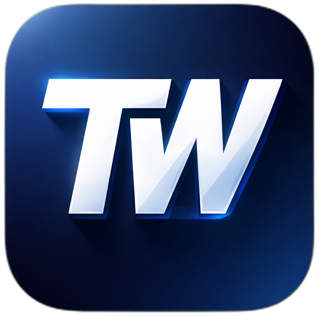
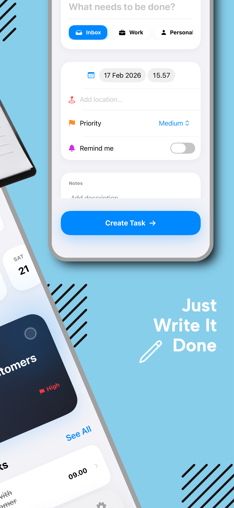
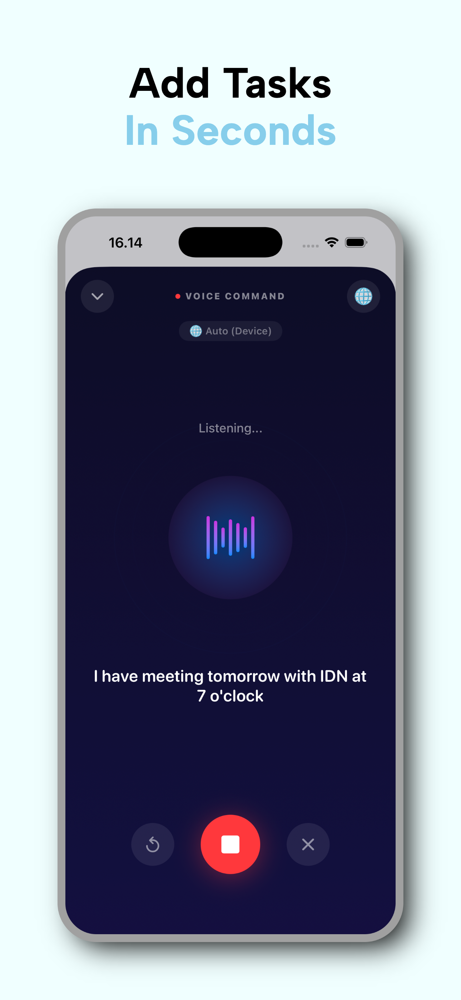
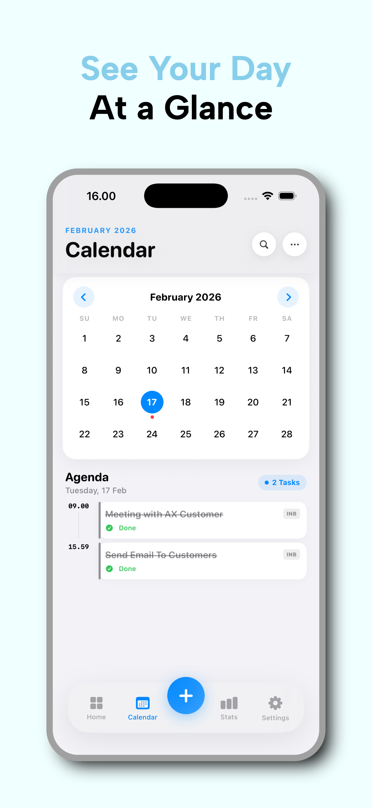
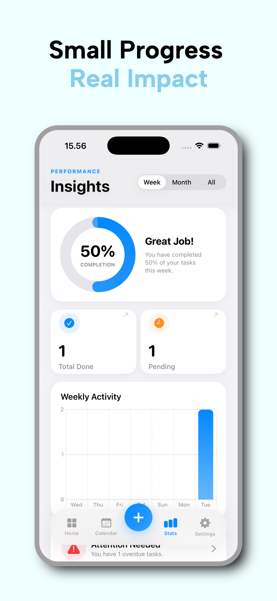
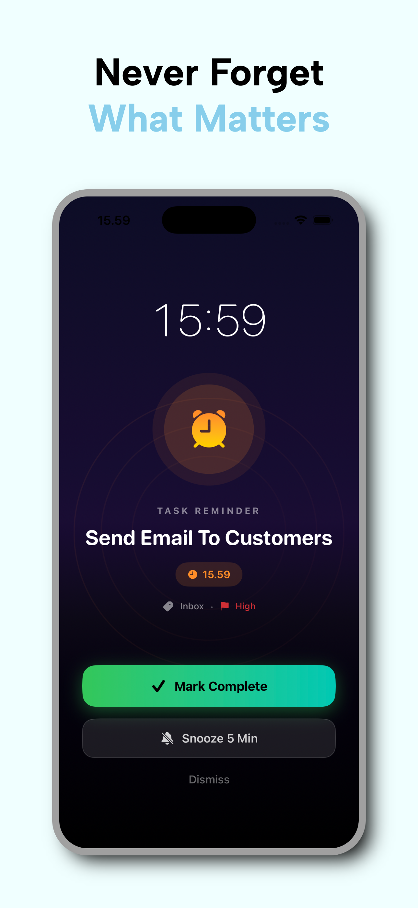

# ToWorks - Smart Task Management

  

  
  
  
  
  
  

ToWorks is a simple daily task app that helps you organize what you need to do, stay on schedule, and keep moving forward—one task at a time.

An intelligent, feature-rich task management app built for iOS using SwiftUI. **ToWorks** combines traditional to-do list functionality with voice commands and productivity statistics.

## ✨ Key Features

### 🎙️ Voice Commands
- **Speech-to-Text Integration**: Add tasks or notes using your voice.
- **Multilingual Support**: Supports multiple languages for voice input.

### 📅 Advanced Scheduling
- **Calendar Integration**: Visualize your tasks on a calendar strip or full calendar view.
- **Reminders & Notifications**: Never miss a deadline with scheduled local notifications.
- **Recurring Tasks**: Setup repeat intervals for habit building.

### 📊 Dashboard & Stats
- **Visual Analytics**: Track your productivity with interactive bar charts and completion stats.
- **Progress Tracking**: See your daily and weekly progress at a glance.

### 📁 Organization
- **Smart Categories**: Organize tasks into Inbox, Work, Personal, Admin, Health, and Study.
- **Priority Levels**: Flag tasks as High, Medium, or Low priority.
- **Attachments**: Add photos and files directly to your tasks.
- **Location Tagging**: Associate locations with your tasks.

## 🛠️ Technical Stack
- **SwiftUI**: Modern, declarative UI framework.
- **SwiftData**: Core data persistence.

- **Speech**: Apple's Speech framework for voice recognition.
- **UserNotifications**: Local notification handling.
- **PhotosUI / FileImporter**: Native attachment handling.

## 🚀 Getting Started

1. Open the project in **Xcode**.
2. Select your target device (iPhone or Simulator).
3. Build and Run (`Cmd + R`).

## 📱 Requirements
- iOS 17.0+
- Xcode 15.0+

---
*Built with ❤️ by RIVAL*
